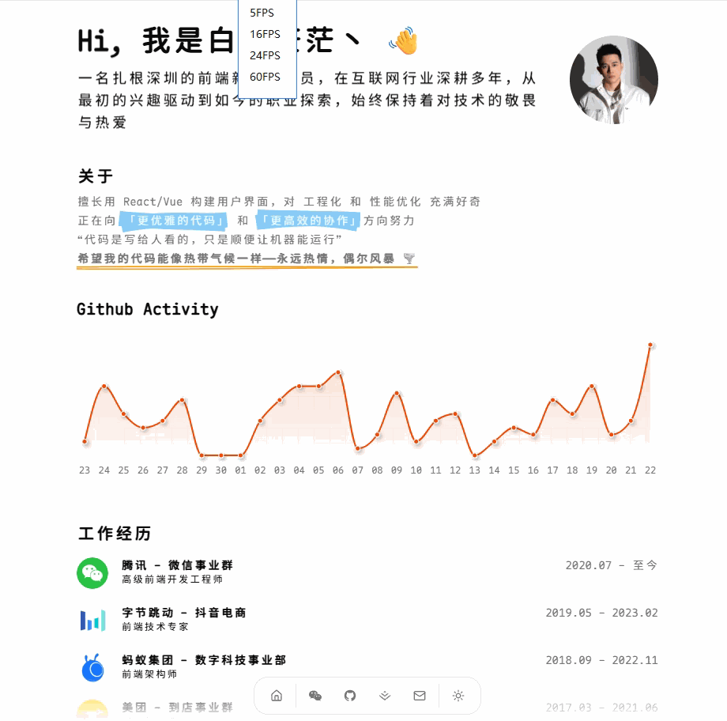

# Portfolio

一个基于 Next.js 的个人作品与简历站点，集成文章聚合、GitHub 活动可视化、SEO 与站点分析，支持暗色主题与高质量动效。


## 在线体验

- 生产环境：[https://portfolio.baiwumm.com](https://portfolio.baiwumm.com)

<div align="center">
  
</div>

## 技术栈

- 框架：Next.js 16、React 19、TypeScript 5
- 样式：Tailwind CSS v4、tw-animate-css
- 可视化：Recharts
- 其他：ahooks、enum-plus、lucide-react

## 特性

- 基于 `Next.js App Router` 的现代架构
- 使用 `Tailwind CSS v4` 与自定义主题变量，支持暗色模式
- GitHub 仓库与贡献统计 API
- Halo 文章列表聚合 API
- Recharts 数据图表可视化
- 完整 SEO 文件：`robots`、`sitemap`、`manifest`
- 集成 Umami、Microsoft Clarity、Google Analytics（生产环境自动启用）

## 环境变量

在项目根目录创建 `.env`，示例：

```bash
# 站点信息
NEXT_PUBLIC_NAME="你的名字"
NEXT_PUBLIC_APP_NAME="Portfolio"
NEXT_PUBLIC_DESC="一句话简介/站点描述"
NEXT_PUBLIC_APP_DOMAIN="https://your-domain.com"
NEXT_PUBLIC_THEME="light" # 可选：light | dark | system

# 分析统计（生产环境生效）
NEXT_PUBLIC_UMAMI_ID=""
NEXT_PUBLIC_CLARITY_ID=""
NEXT_PUBLIC_GA_ID=""

# GitHub API
GITHUB_TOKEN="" # 只读 Token
NEXT_PUBLIC_GITHUB_USERNAME="your-github-username"

# Halo API
HALO_TOKEN="" # 只读 Token
```
## 本地开发
```bash
# 克隆项目
git clone https://github.com/baiwumm/portfolio.git

# 进入项目目录
cd portfolio

# 安装依赖
pnpm install

# 启动开发服务器
pnpm dev
```

## Vercel 一键部署
1. `Fork` 本项目，在 `Vercel` 官网点击 `New Project`
2. 点击 `Import Git Repository` 并选择你 fork 的此项目并点击 `import`
3. `PROJECT NAME`自己填，`FRAMEWORK PRESET` 选 `Other` 然后直接点 `Deploy` 接着等部署完成即可

<a href="https://vercel.com/dashboard" target="_blank">

</a>

## 许可证
本项目采用 [MIT](LICENSE) 许可证。

## Star History

[](https://www.star-history.com/#baiwumm/portfolio&type=date&legend=top-left)